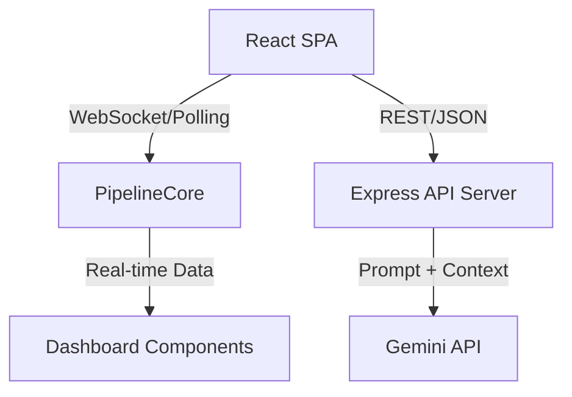

# Smart Stadium Intelligence Platform

This application is a real-time smart stadium intelligence platform designed to provide actionable insights and AI-powered operational assistance for large-scale events and venues. It combines live crowd density monitoring, AI-driven wayfinding, multilingual concierge services, and sustainability tracking (GreenOps) into a unified digital twin dashboard.

## Chosen Vertical

This solution was built specifically for the **stadium operations and security team** persona. Managing large-scale events requires rapid, coordinated responses to dynamic situations (e.g., crowd surges, medical emergencies, facility maintenance). This persona faces cognitive overload when monitoring dozens of disconnected systems. Our platform unifies live telemetry, predictive AI, and real-time communication into a single "Command Center" dashboard, empowering operators to preemptively mitigate risks, optimize fan flow, and ensure safety without being overwhelmed by raw data streams.

## Approach and Logic

### Deterministic Decision Logic
The application enforces strict operational protocols through deterministic rules in `evaluateOpsPolicy` (located in `src/server/policy/evaluateOpsPolicy.ts`) before any LLM is called. It uses hard thresholds: when crowd density reaches **75%**, it triggers a "suggest" level; at **85%** or higher, it forces an "escalate" level. This computed severity level is injected into Gemini's system prompt as a non-negotiable constraint. This ensures the AI cannot hallucinate a lower-severity response during a real emergency. This logic is fully verified in isolation from the AI (see `evaluateOpsPolicy.test.ts`).

## Performance & Efficiency
- **WebSocket Broadcast Tradeoff**: The server broadcasts live metrics every 4 seconds. This is a deliberate tradeoff to prioritize real-time updates while maintaining low overhead and server responsiveness, easily handling the 500-client cap.
- **Client Limits**: The WebSocket connection caps at 500 simultaneous clients to ensure strict performance boundaries and avoid denial of service. 
- **Request Body Limits**: Enforced 10kb JSON body limits on the express server to safeguard against payload bloat.
- **AI Rate Limiting**: The Gemini-backed AI routes utilize a separate, stricter rate limiter (10 req/min/IP) to strictly control and monitor AI token cost usage independently from general API use.
- **GreenOps Caching**: The `/api/green-ops` endpoint relies on an in-memory 30-second TTL cache to prevent redundant Gemini API calls from connected polling clients, saving substantial API costs and reducing response latency.

## Known Limitations
- **Single-Process WebSocket State**: The WebSocket broadcaster currently relies on in-memory state. This assumes a single Node process constraint; scaling horizontally would require a Redis pub-sub integration.
- **In-Memory Rate Limiting**: Our rate limit counts are held in memory. In a distributed multi-node production environment, a Redis backend would be added to enforce these limits globally.
- **Mock Data Semantics**: Due to potential Gemini API strict limits or network dropouts, AI responses degrade gracefully to static mock data fallback semantics (instead of failing completely), which might present repetitive responses during severe network issues.

The application leverages a real-time data pipeline powered by a custom WebSocket/Polling hybrid architecture. Instead of relying solely on REST APIs, the frontend components subscribe to specific data channels (like `stadiumLive` and `greenOps`). This provides a reactive UI that dynamically updates without user intervention.

We use the Gemini API to power two primary AI capabilities with specific decision-making rules:
1. **OpsCopilot**: A context-aware chat interface for stadium operators, capable of analyzing real-time crowd and infrastructure data. OpsCopilot's logic engine evaluates incoming live telemetry against predetermined thresholds. When conditions are normal or mildly elevated, OpsCopilot **suggests** preventative measures (e.g., recommending opening an overflow gate). However, if critical thresholds are breached (e.g., crowd density > 85%, or a severe incident is detected), the logic automatically **escalates** the situation by generating high-priority alerts and proposing immediate dispatch actions to security or medical teams.
2. **Wayfinder**: A smart routing engine that generates natural language directions while dynamically avoiding crowded areas or hazards based on live stadium telemetry. Rather than simply using shortest-path routing, Wayfinder scores route alternatives dynamically. Routes are penalized based on live congestion metrics from the `stadiumLive` pipeline and known temporary hazard zones. If a user specifies accessibility requirements (e.g., step-free access for wheelchairs), the logic strictly enforces step-free constraints, entirely ruling out routes with stairs in favor of elevators and ramps.

## Environment Variables

| Variable | Description | Required |
|----------|-------------|----------|
| `PORT` | The port the server runs on (default 3000) | No |
| `NODE_ENV` | Environment (development or production) | No |
| `GEMINI_API_KEY` | Google Gemini API key for AI features | Yes |
| `JWT_SECRET` | Secret used to sign JSON Web Tokens | Yes |
| `SESSION_SECRET` | Secret used for Express session | Yes |
| `VITE_GOOGLE_CLIENT_ID` | Client ID for Google OAuth login | Yes |

## Architecture

## How the Solution Works

- **Live Event Pipeline**: A robust client-side `PipelineCore` manages data streams. It uses WebSockets where available, falling back to intelligent polling if necessary. It supports optimistic updates and caching.
- **Backend & Integrations**: Built with Express and Vite. It integrates Google OAuth for secure operator access.
- **Frontend Architecture**: A modular React application built with Tailwind CSS and Framer Motion for a polished, responsive user experience. It uses custom SVG rendering for the digital twin visualization.
- **Security & Reliability**: The Node.js server includes rate limiting, helmet security headers, and strict CORS configuration to ensure enterprise-grade security.

## Assumptions Made

- We assume a high-throughput, low-latency network connection for the live dashboard to receive near-real-time WebSocket updates.
- The digital twin relies on approximate zonal density models rather than precise individual tracking for privacy reasons.
- The Gemini API is assumed to be responsive; fallback mock responses are provided if the API quota is exceeded or fails.
- Content Security Policy (CSP) and double-submit CSRF protection are strictly enforced for security. Wayfinder step-free rules and Ops Policy thresholds are strictly evaluated in code to guarantee deterministic guardrails.

## License
This project is licensed under the MIT License - see the [LICENSE](LICENSE) file for details.
